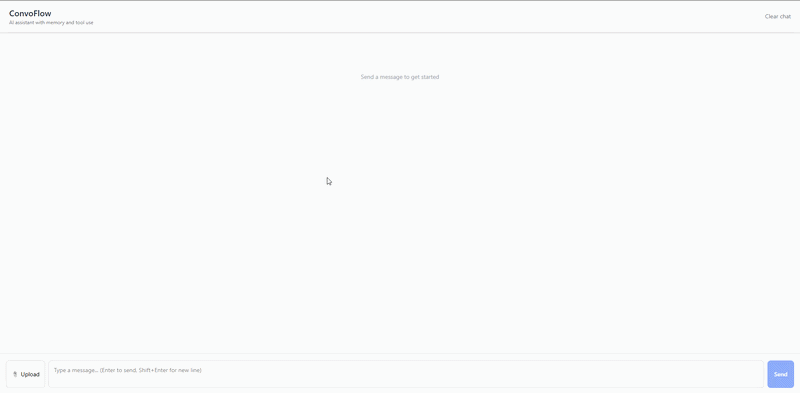
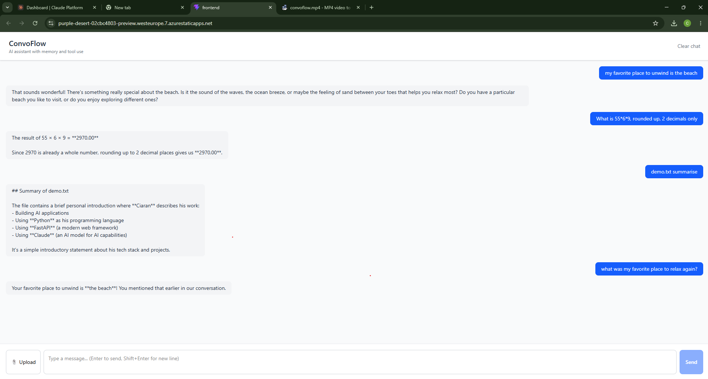

# ConvoFlow

A full-stack conversational AI assistant with semantic memory, agentic tool use, and real-time streaming — deployed to Azure.





## Features

- **Streaming responses** — tokens render in real time via Server-Sent Events
- **Semantic memory** — remembers past conversations using HuggingFace embeddings and ChromaDB vector search
- **Agentic tool use** — Claude decides when to invoke a calculator or read uploaded files
- **File upload** — upload `.txt`, `.md`, `.csv` files and ask Claude to analyse them
- **Multi-turn conversation** — full session history passed to the model on every turn

## Tech Stack

| Layer | Technology |
|---|---|
| Backend | Python 3.12 + FastAPI |
| AI | Anthropic Claude API (Sonnet + Haiku) |
| Memory | HuggingFace `all-MiniLM-L6-v2` + ChromaDB |
| Frontend | React + Vite + TailwindCSS |
| Deployment | Azure App Service + Azure Static Web Apps + Docker |

## Architecture

User (browser)
│
▼
React Frontend (Azure Static Web Apps)

Streaming token display (SSE)
File upload
Session management
│
▼
FastAPI Backend (Azure App Service / Docker)
├── /chat          POST — full response with tool use
├── /chat/stream   POST — SSE streaming response
├── /upload        POST — file upload
├── /history       GET  — session history
└── /clear         POST — reset session
│
├── Claude API
│     ├── Tool: calculator
│     └── Tool: read_file
│
└── Memory Layer
├── HuggingFace embeddings
└── ChromaDB vector store

## Running Locally

### Prerequisites
- Python 3.12
- Node.js 18+
- Anthropic API key

### Backend

```bash
cd backend
python -m venv venv
venv\Scripts\activate  # Windows
pip install -r requirements.txt
```

Create a `.env` file in the project root:

ANTHROPIC_API_KEY=your-key-here

```bash
uvicorn main:app --reload
```

API docs available at `http://localhost:8000/docs`

### Frontend

```bash
cd frontend
npm install
npm run dev
```

Open `http://localhost:5173`

### Docker

```bash
cd backend
docker build -t convoflow-backend .
docker run -p 8000:8000 --env-file ../.env convoflow-backend
```

## Project Structure

convoflow/
├── backend/
│   ├── main.py        # FastAPI routes
│   ├── chat.py        # Claude API + streaming + tool loop
│   ├── memory.py      # ChromaDB + HuggingFace embeddings
│   ├── tools.py       # Tool definitions and handlers
│   ├── models.py      # Pydantic models
│   ├── requirements.txt
│   └── Dockerfile
├── frontend/
│   ├── src/
│   │   ├── App.jsx
│   │   ├── components/
│   │   │   ├── MessageList.jsx
│   │   │   ├── MessageInput.jsx
│   │   │   └── StreamingMessage.jsx
│   │   └── hooks/
│   │       └── useChat.js
│   └── package.json
└── README.md

## Deployment

Backend deployed to **Azure App Service** via Docker and Azure Container Registry.  
Frontend deployed to **Azure Static Web Apps**.

## Author

Ciaran Brennan — [GitHub](https://github.com/Ciaran11221)